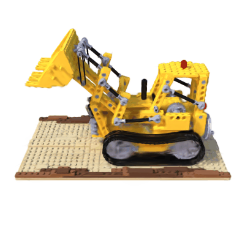
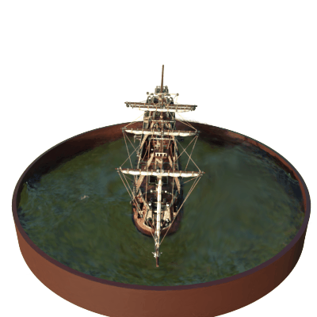

# torch-splatting

PyTorch implementation of [3D Gaussian Splatting](https://repo-sam.inria.fr/fungraph/3d-gaussian-splatting/) for learning purposes. Uses [gsplat](https://github.com/nerfstudio-project/gsplat) for the rasterizer.

Heavily inspired by [hbb1/torch-splatting](https://github.com/hbb1/torch-splatting).

| lego (38 dB) | ship (29 dB) |
|:---:|:---:|
|  |  |

## files

- `camera.py` — camera class, projection matrix
- `data.py` — NeRF synthetic and Mip-NeRF 360 loaders
- `loss_utils.py` — L1 and SSIM losses
- `model.py` — gaussian parameters, init, save/load PLY
- `orbit.py` — render orbit GIF around scene
- `renderer.py` — projection, covariance, EWA splatting (reference), gsplat render
- `requirements.txt`
- `sh_utils.py` — spherical harmonics evaluation
- `train.py` — training loop, densification, opacity reset, SH scheduling
- `viz.py` — render training views vs ground truth
